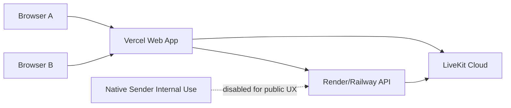
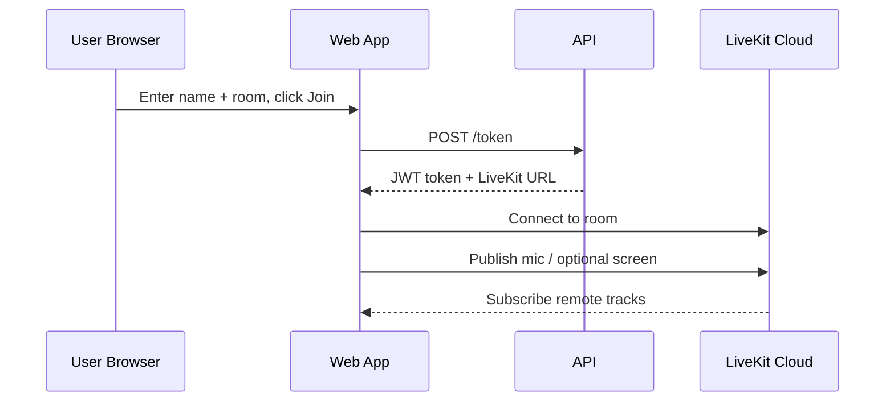
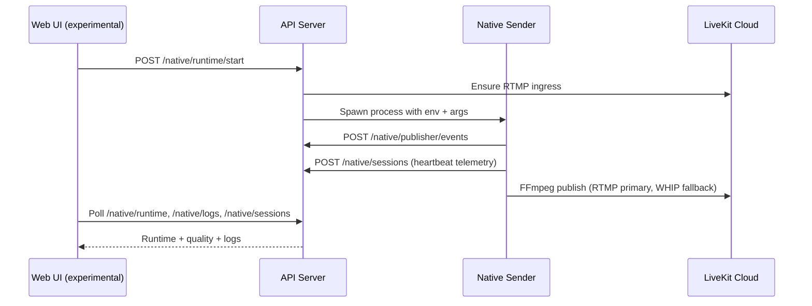

# MyCord / DCMAX Master Project Documentation

This is the single-source technical and operational document for the rebuilt MyCord project.

## 1. Project Overview

MyCord is a web-first, real-time 1:1 collaboration app focused on:

- Low-latency voice calling
- Smooth screen sharing
- Cross-device operation
- Optional native sender experimentation for higher capture quality

Current launch direction is **public web-first** with native controls hidden behind a feature flag.

---

## 2. High-Level Architecture

### Components

- `apps/web`: Next.js frontend (React + TypeScript + Tailwind + LiveKit client SDK)
- `apps/api`: Node.js/Express backend (TypeScript + LiveKit server SDK)
- `apps/native-sender`: Rust native capture/publisher service (Windows-first advanced path, macOS scaffold)
- Live transport: LiveKit Cloud

### Data and media responsibilities

- Web app:
  - UI state and user controls
  - Local media capture in browser
  - LiveKit room connect/publish/subscribe
  - Optional native runtime control + telemetry display (when enabled)
- API:
  - Token issuance
  - CORS and security boundaries
  - Native runtime process management
  - Native telemetry and publisher event ingestion
  - LiveKit RTMP ingress provisioning for native publisher path
- Native sender:
  - Capture probing and backend selection
  - FFmpeg encode/publish process orchestration
  - Runtime status + heartbeat reporting to API

---

## 3. End-to-End Flowcharts

## 3.1 Public launch (web-first)



## 3.2 Web call join and media path



## 3.3 Native runtime control and telemetry



---

## 4. Monorepo Structure

- `apps/web`: frontend app
- `apps/api`: backend API
- `apps/native-sender`: Rust native sender
- `infra`: infra configs
- `docs`: architecture, deployment, QA, roadmap docs

---

## 5. Web App Technical Implementation (`apps/web`)

### Core behavior

- Uses LiveKit `Room` lifecycle for connection and state:
  - connect/disconnect/reconnect handlers
  - participant track subscribe handling
  - connection quality display
- Supports:
  - Mic selection
  - Mute/unmute
  - Screen share toggle with quality profiles
  - Copy invite link
  - Fullscreen remote stream
  - Keyboard shortcuts (`M`, `S`, `F`)

### Quality and UX mechanics

- `adaptiveStream` + `dynacast` enabled
- Simulcast layers configured for better downstream adaptation
- Quality profiles map resolution + frame rate + bitrate intent
- Browser capability guards:
  - secure-context checks for media APIs
  - device enumeration fallbacks
  - user-facing warnings for unsupported contexts

### Native experimental integration

- Feature flag:
  - `NEXT_PUBLIC_ENABLE_NATIVE_EXPERIMENTAL`
- If enabled:
  - Polls native session telemetry
  - Polls native publisher state
  - Polls native runtime status + logs
  - Allows start/stop runtime from UI
  - Provides source preference toggle (native vs web participant)
- If disabled:
  - Native UI controls and logs hidden
  - Public users remain in web-only path

### UI evolution completed

- Full dark-console redesign with:
  - fixed sidebar
  - high-contrast status pills
  - mono/technical visual tone
  - sharper corners and border hierarchy
  - cleaner dashboard-like layout

---

## 6. API Technical Implementation (`apps/api`)

### Runtime and env model

- Parses env via `zod`
- Supports production constraints:
  - requires `NATIVE_CONTROL_SECRET` in production
  - requires explicit origin config in production
- Security middleware:
  - `cors` with allowlist
  - `helmet`
  - `express-rate-limit`

### Core endpoints

- Health:
  - `GET /health`
- Auth/token:
  - `POST /token`
  - supports `clientType`:
    - `web`
    - `native_sender`
- Native telemetry:
  - `POST /native/sessions`
  - `GET /native/sessions/:roomName`
  - `POST /native/publisher/events`
  - `GET /native/publisher/:roomName`
- Native runtime control:
  - `POST /native/runtime/start`
  - `POST /native/runtime/stop`
  - `GET /native/runtime/:roomName`
  - `GET /native/runtime/:roomName/logs`
- Ingress provisioning:
  - `POST /native/ingress/ensure`

### Native runtime orchestration details

- API spawns native sender process (`cargo run -- ...`) with room/capture/encoder args
- Maintains in-memory maps for:
  - runtime records
  - process handles
  - bounded runtime logs
- Maps native publisher state into runtime status
- Auto-ensures LiveKit RTMP ingress and injects `LIVEKIT_RTMP_URL` when launching runtime

---

## 7. Native Sender Technical Implementation (`apps/native-sender`)

### Native sender goals

- Probe capture backend quality
- Publish capture stream through FFmpeg to LiveKit ingest path
- Report live telemetry and lifecycle events to API for observability

### Runtime flow

1. Load env/CLI config
2. API health check
3. Fetch `native_sender` token from API
4. Publisher bootstrap:
   - LiveKit TCP reachability check (hard requirement)
   - WS signal probe (best effort warning path)
5. Start FFmpeg publisher process (unless dry run)
6. Capture pipeline bootstrap report
7. Heartbeat loop:
   - publish session metrics
   - monitor publisher process health
   - post error/stopped events on failure/shutdown

### Capture/encoder modes

- Capture modes:
  - `auto`
  - `scrap`
  - `ffmpeg-ddagrab`
- Encoder modes:
  - `ffmpeg-h264-nvenc`
  - `ffmpeg-libx264`
  - `fast` placeholder path

### FFmpeg publishing path

- RTMP preferred when `LIVEKIT_RTMP_URL` exists
- WHIP path retained as fallback path via URL resolution/env overrides
- Realtime-friendly flags include:
  - CFR timing controls
  - short GOP / keyframe cadence
  - no B-frames
  - constrained bitrate/buffer
- Stderr is piped, tailed, and surfaced for diagnostics without deadlocking

### Native telemetry/event model

- Session metric payload:
  - achieved FPS
  - produced/dropped frames
  - ingest latency
  - payload bytes
- Publisher state events:
  - `starting`
  - `running`
  - `stopped`
  - `error`

---

## 8. What Has Been Done (Chronological Outcome Summary)

### Foundation and architecture

- Rebuilt from earlier P2P/Electron concept into web-first stack with LiveKit SFU.
- Established monorepo with web + API + native sender app.

### Web reliability and usability fixes

- Fixed browser media API availability issues in non-secure contexts.
- Added capability messages for platform/browser audio-share limitations.
- Hardened handling for ngrok HTML warning responses via content-type checks and headers.
- Implemented robust room/join lifecycle UX, reconnection handling, and toasts.

### Native observability and control

- Added native telemetry endpoints and live polling in web UI.
- Added runtime lifecycle control endpoints (start/stop/status/logs).
- Added publisher lifecycle event reporting from native app to API.
- Added in-memory runtime logs and status propagation to UI.

### Native media ingest implementation

- Added bootstrap connectivity checks and signaling probe logic.
- Implemented FFmpeg launch path with capture/encoder mode controls.
- Added RTMP ingress provisioning via LiveKit server SDK from API.
- Added environment-driven ingest target resolution and fallback behavior.

### Quality/performance stabilization work

- Iterated FFmpeg flags for low-latency browser playback behavior.
- Added encoder-specific presets/tunes and pixel format handling fixes.
- Added keyframe/gop/b-frame/sc-threshold tuning.
- Added backend fallback behaviors in Windows path.

### UI/UX redesign

- Reworked UI into a minimal dark dashboard style.
- Added status chips for connection/native state, logs panel, and control surfaces.
- Improved contrast, typography, and visual consistency.

### Deployment readiness hardening

- Added production checks for secret/origin envs in API startup.
- Added security middleware and rate limiting.
- Added provider manifests (`render.yaml`, `railway.toml`).
- Added deployment and QA runbooks:
  - `docs/public-launch-runbook.md`
  - `docs/production-e2e-qa.md`
  - `docs/native-private-beta-milestone.md`

---

## 9. Environment Variables (Operational Reference)

## 9.1 API (`apps/api`)

- `NODE_ENV`
- `PORT`
- `WEB_ORIGINS` (or `WEB_ORIGIN`)
- `LIVEKIT_URL`
- `LIVEKIT_API_KEY`
- `LIVEKIT_API_SECRET`
- `NATIVE_CONTROL_SECRET`
- `NATIVE_SENDER_BIN` (default `cargo`)
- `NATIVE_SENDER_WORKDIR` (optional)

## 9.2 Web (`apps/web`)

- `NEXT_PUBLIC_API_BASE_URL`
- `NEXT_PUBLIC_ENABLE_NATIVE_EXPERIMENTAL`
- `NEXT_PUBLIC_NATIVE_CONTROL_SECRET` (keep empty/unset in public mode)

## 9.3 Native sender (`apps/native-sender`)

- Consumes API/LiveKit vars injected by API runtime launch
- Optional ingest overrides:
  - `LIVEKIT_RTMP_URL`
  - `LIVEKIT_WHIP_URL`
  - `LIVEKIT_WHIP_BEARER_TOKEN`

---

## 10. Deployment Model (Recommended)

## 10.1 Public production

- Web on Vercel
- API on Render (or Railway)
- LiveKit Cloud as media backbone
- Native experimental disabled for public users

## 10.2 Deployment order

1. Deploy API and verify `/health`
2. Set Vercel web env to point to API domain
3. Deploy web
4. Update API CORS origins to exact Vercel domain(s)
5. Run two-device production QA + LiveKit console verification

---

## 11. Known Constraints and Tradeoffs

- Browser-based system audio share has platform/browser limitations.
- Current native publish path uses ingest bridge approach (RTMP/WHIP), not direct native WebRTC publish.
- Runtime state is in-memory in API (sufficient for current scope, not HA persistence).
- Public launch intentionally prioritizes stable web path over exposing experimental native controls.

---

## 12. Next Milestone (Native Private Beta)

Planned direction:

- Implement direct native WebRTC publish path to LiveKit SFU
- Add identity allowlist for private beta runtime controls
- Expand telemetry with reconnect/fatal diagnostics
- Re-enable native UI only behind private beta flags
- Validate long-session stability and degraded-network behavior

See `docs/native-private-beta-milestone.md`.

---

## 13. Quick Commands

From repo root:

```bash
npm install
npm run dev:api
npm run dev:web
```

Production checks:

```bash
npm run build --workspace api
npm run build --workspace web
```

---

## 14. Reference Docs in Repository

- `README.md`
- `docs/native-capture-blueprint.md`
- `docs/public-launch-runbook.md`
- `docs/production-e2e-qa.md`
- `docs/native-private-beta-milestone.md`

